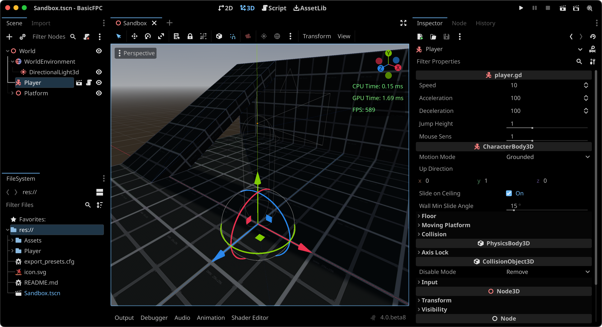

# Godot 4 - Basic First Person Controller
This project contains the basic implementation of a First Person character controller for the [Godot 4 [Beta 17]](https://downloads.tuxfamily.org/godotengine/4.0/beta17/).

The code found in [player.gd](Player/player.gd) uses vector forces to move the player. You can tweak the values of the forces in the editor directly. The _velocity_ of the player is calculated as a result of the vector sum of different vector forces: walk, jump and gravity.

The main scene is a _Sandbox_ scene used to test the controls:

## Controls
| Keys | Action Name | Description |
|:------:|:-------------:|:-------------:|
| `W` | `move_forward` | Move forward |
| `S` | `move_backwards` | Move backwards |
| `A` | `move_left` | Move to the left |
| `D` | `move_right` | Move to the right |
| `Space` | `jump` | Apply jump force |
| `Esc` | `exit` | Closes the game |

You can change any of this keys in the Project Settings -> Input Map.
