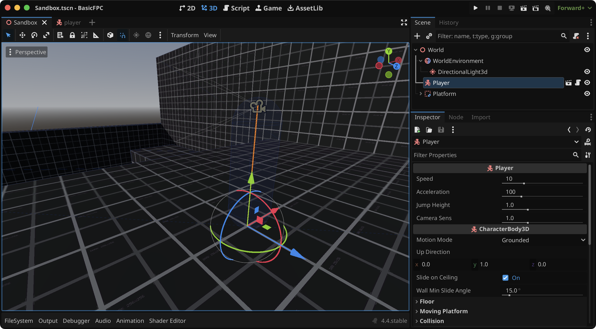

# Godot 4 - Basic First Person Controller
This project contains the basic implementation of a First Person character controller for [Godot 4](https://godotengine.org).

The code found in [player.gd](Player/player.gd) uses vector forces to move the player. You can tweak the values of the forces in the editor directly. The _velocity_ of the player is calculated as a result of the vector sum of different vector forces: walk, jump and gravity.

The main scene is a _Sandbox_ scene used to test the controls:

## Controls
| Keys | Action Name | Description |
|:------:|:-------------:|:-------------:|
| <kbd>W</kbd>,<kbd>A</kbd>,<kbd>S</kbd>,<kbd>D</kbd>, <kbd>left stick</kbd> | `move_` + _dir_ | Move |
| `mouse`, <kbd>right stick</kbd> | `look_` + _dir_ | Look/Aim |
| <kbd>Space</kbd>, <kbd>Xbox Ⓐ</kbd> | `jump` | Apply jump force |
| <kbd>Shift</kbd>, <kbd>Xbox LB</kbd> | `sprint` | Increase movement speed (Sprint) |
| <kbd>Ctrl</kbd>, <kbd>Xbox RB</kbd> | `crouch` | Decrease movement speed (Crouch) |
| <kbd>ESC</kbd>, <kbd>Xbox Ⓑ</kbd> | `exit` | Close the game |

You can change any of this keys in: Project Settings → Input Map.
